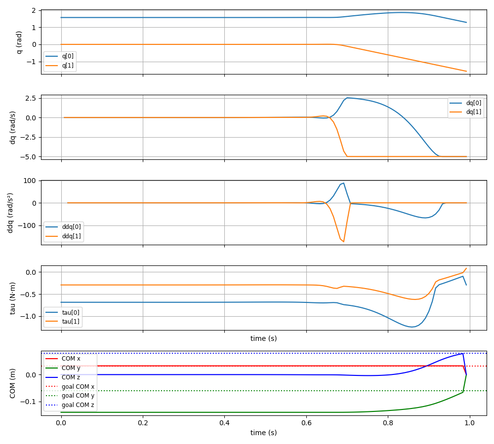
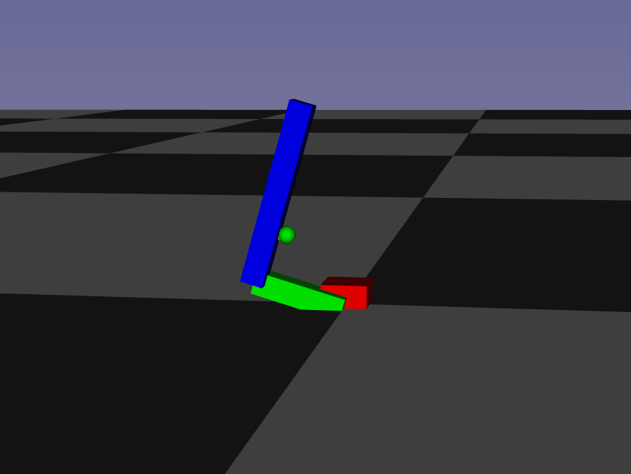

# Pinocchio and CasADi Optimization for Double Pendulum Simulation 

## Overview

This repository provides a simulation framework for a double pendulum model using the Pinocchio library for robot kinematics and CasADi for optimization. The files include tools for building the robot model, performing optimization, visualizing results, and controlling the motion using optimal trajectories.

The code performs the following tasks:
- Loads a URDF model and builds a kinematic model using Pinocchio.
- Sets up and solves an optimization problem to generate joint trajectories for the double pendulum.
- Visualizes the results and plays the optimized motion in Gepetto Viewer.

## Files

- **main.py** : The main script for simulating and optimizing the double pendulum.
        - Loads a URDF model of the pendulum, builds the kinematic model using Pinocchio, and sets up optimization using CasADi.
        - The script includes forward kinematics, constraint handling, and optimization problem formulation.
        - Optimizes for a trajectory considering both energy and safety costs, then visualizes the results.

- **casadi_fun.py** : Contains helper functions for setting up and solving optimization problems using CasADi.
        - Defines the function make_pinocchio_model to create the optimization model, including the kinematics and dynamic equations.
        - Handles constraints and cost function setup for the optimization problem.
        - Contains the safety function to ensure the center of mass (COM) stays within specified limits.

- **ploting_fun.py** : Includes functions for plotting the results of the optimization
         - Plot_results generates plots of joint positions (q), velocities (dq), accelerations (ddq), torques (tau), and center of mass (COM) trajectories.
         - play_in_gepetto allows visualizing the optimized trajectory in the Gepetto Viewer.

- **run_with_gepetto.sh** : A script to launch the program and execute the Python script with the optimization and visualization process. 

To use it, simply run from the command line :
```bash
./run_with_gepetto main.py
```
    

## Dependencies

All dependencies can be installed using pixi. From the home directory, run the following command:
```bash
pixi install
```

This will install all necessary libraries, including:

**Pinocchio**: A C++/Python library for kinematics and dynamics of rigid-body systems.

**CasADi**: A symbolic framework for optimization and automatic differentiation.

**Matplotlib**: For plotting simulation results.

**Gepetto Viewer**: For visualizing the robot motion and trajectory.

All dependancies can be found in the _pyproject.toml_ file in the root directory.

## Results

This simulation includes in the cost function both energy and safety (for maintaining balance). Thus, the focus is made on the Center Of Mass of the model. 
In a first place, Direct Optimal Control is performed such as joints angles trajectories are computed in order to achieve COM displacement to it's goal. Then, these exemple trajectories are used to feed the IOC algorithm to recover the weight of energy and safety features. 





In green is the goal position of the center of mass